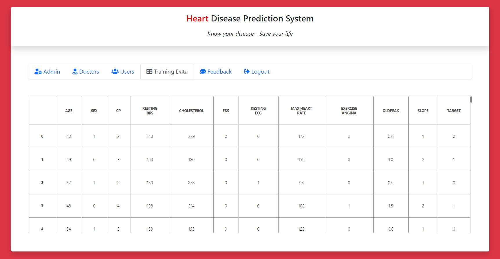

## HeartDiseasePrediction

1. This is web application for Heart Disease Prediction System using php and python.
2. It takes user's health data and gives predicted result of having heart disease their or not.
3. Here, user can check the basic(10 year CHD) and advanced level of heart risk calculation.
4. The heart risk calculations are done using Machine Learning algorithms (Logistic regression model and other classification models).
5. Here, training and testing of our classification model done on framingham and cleveland datasets.

## Application screenshosts

  <h3> Home Page </h3>
  
  
  
  
  
  
  
  
  
   

  
